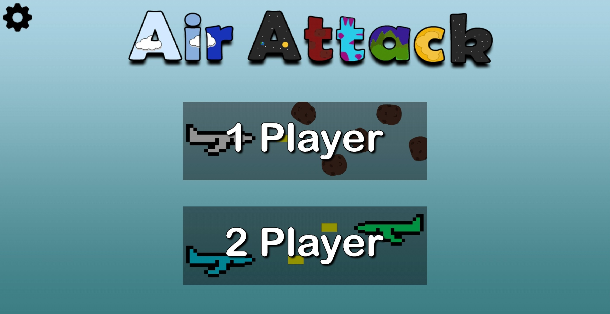
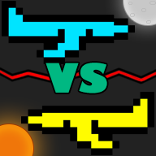

# AirAttack

AirAttack is an Android game application that I have been developing. This repository contains the APK file that can be installed on an Android device.

## About
In this game, you control a plane on the left side of the screen with your thumb. The plane will follow your finger vertically as you move it up and down the screen. When you let your finger off of the screen, the plane will shoot a yellow bullet out in front. The goal is to destroy all the in-coming asteroids to complete levels with the bullets. As you progress through, each level and world will get harder as the asteroids come faster and more in number. If too many come at once, you can swipe from the front of the plane to the back to create a shield for the plane. This will make the plane invincible to asteroids. Once the shield is hit, it will shatter, and the plane will be vulnerable again. The current version allows only the first three worlds to be played. More will come soon.

